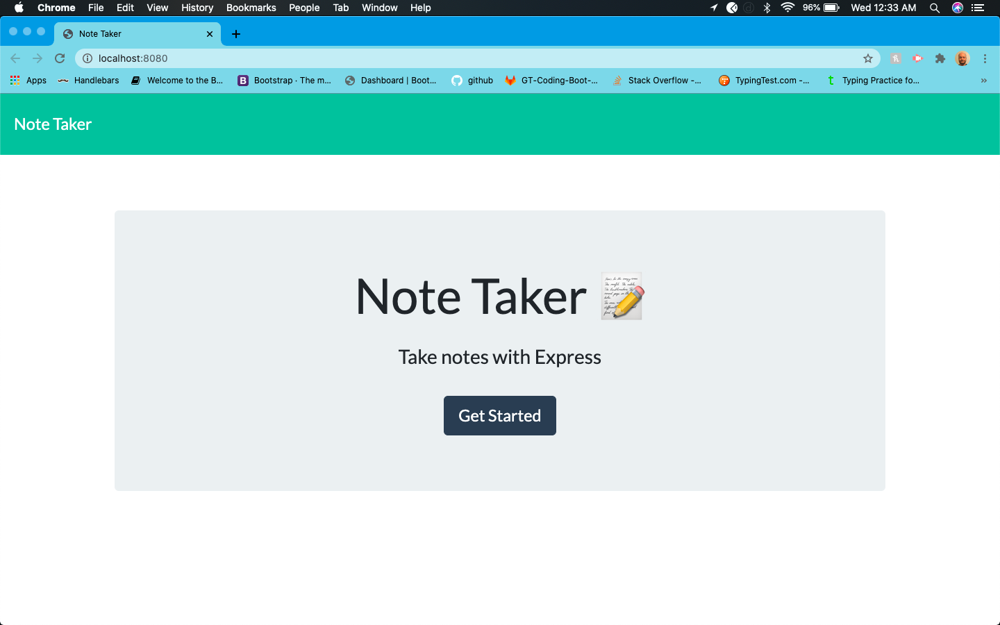
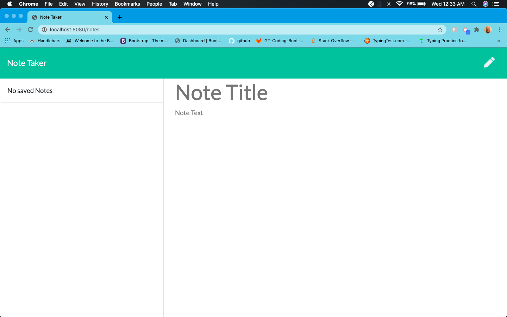
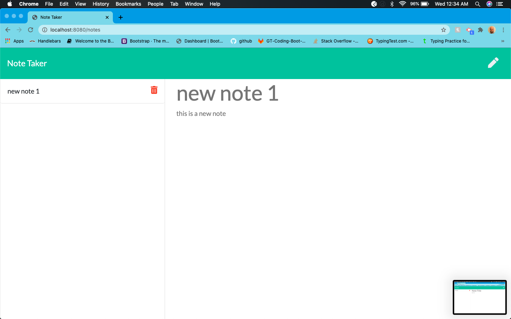
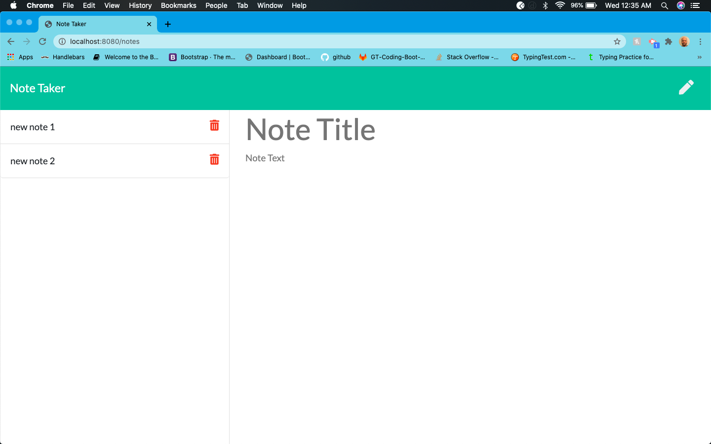

# Note-Taker

**Description**

This is a note taking app. You can use this app to take notes save them and delete them. I created the server.js file for this app.

**Installation**

Clone the project from Github. In VS Code from the terminal run npm start and click on the link that pops up.
You can also click this link.

**Usage**

When the page loads you are presented with the index.html page. 

Click on get started and you will be taken to the notes page. 

Enter a title for the note and enter your notes. Click the disk icon to save the note. The note will be displayed to the left

If you click on the note tile the note will be displayed.

Click on the pencil icon to start a new note.

Click on the trash icon to delete a note.

**License**

MIT License

Copyright (c) [2020] [Dennis Francis]

Permission is hereby granted, free of charge, to any person obtaining a copy
of this software and associated documentation files (the "Software"), to deal
in the Software without restriction, including without limitation the rights
to use, copy, modify, merge, publish, distribute, sublicense, and/or sell
copies of the Software, and to permit persons to whom the Software is
furnished to do so, subject to the following conditions:

The above copyright notice and this permission notice shall be included in all
copies or substantial portions of the Software.

THE SOFTWARE IS PROVIDED "AS IS", WITHOUT WARRANTY OF ANY KIND, EXPRESS OR
IMPLIED, INCLUDING BUT NOT LIMITED TO THE WARRANTIES OF MERCHANTABILITY,
FITNESS FOR A PARTICULAR PURPOSE AND NONINFRINGEMENT. IN NO EVENT SHALL THE
AUTHORS OR COPYRIGHT HOLDERS BE LIABLE FOR ANY CLAIM, DAMAGES OR OTHER
LIABILITY, WHETHER IN AN ACTION OF CONTRACT, TORT OR OTHERWISE, ARISING FROM,
OUT OF OR IN CONNECTION WITH THE SOFTWARE OR THE USE OR OTHER DEALINGS IN THE
SOFTWARE.
